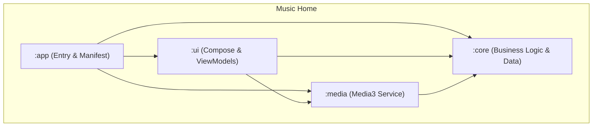

# Music Home 🎶🛡️

**Music Home transforms Android devices into dedicated music appliances.** Rather than behaving like a traditional Android launcher, Music Home presents a dedicated, distraction-free music environment where playback is always the primary experience.

It strips away the distractions of a standard phone interface and replaces it with a high-fidelity, music-centric environment inspired by classic high-end audio equipment like Sony Walkmans, vintage amplifiers, and modern high-end DAPs (Digital Audio Players).

---

## 📸 Screenshots

*Screenshots coming soon!*

---

## 🏛️ Philosophy

Music Home is built on a simple idea: **Old Android devices deserve a second life.**

Instead of becoming e-waste, they can become beautiful, dedicated music players that remain focused on one purpose—enjoying your music without distractions. Music Home aims to make Android disappear, leaving only the music.

---

## 🚧 Project Status

Music Home is currently under active development, moving from a "launcher" mindset to a "dedicated appliance" mindset.

**Current focus:**
- [x] Home Launcher registration
- [x] Basic "Walkman Orange" UI implementation
- [x] Media3 Playback Service integration
- [x] Robust Local Media Scanning & Room Database
- [x] Clean Architecture (Core/UI separation)
- [ ] **Adaptive Appliance Layouts** (Tablet/Large Screen optimization)
- [ ] **Hardware-First UI** (Brushed metal textures, high-fidelity widgets)

---

## 🎯 Target Devices

Designed to give a new purpose to recycled Android hardware:

- **Old Android Tablets**: Transform them into wall-mounted control panels or bedside hi-fi hubs.
- **Spare Android Smartphones**: Create a permanent, distraction-free pocket player.
- **Android-based DAPs**: A custom OS feel for offline-first listening.
- **Android TV Boxes**: Turn them into dedicated media hub appliances (Future).

---

## ✨ Features

- **🏠 Dedicated Appliance Mode**: Registers as the system home screen. The "Home" button is a "Return to Music" button.
- **🎧 Hardware-Inspired UI**: A premium dark-themed interface with metallic accents, brushed textures, and vibrant "Walkman Orange" highlights.
- **🕒 Hi-Fi Display**: Persistent clock, battery status, and bitrate information integrated like a high-end audio deck, supporting full **Immersive Mode**.
- **📂 Focused Library Management**: Seamlessly browse local MP3/FLAC files using a robust modern media engine (Media3/ExoPlayer), with a focus on large artwork and metadata.
- **🎵 Offline First**: Built around local music libraries. Your collection stays on your device and remains fully functional without an Internet connection.
- **📱 Integrated Extras**: A secondary tab for launching other music-related apps (Spotify, Tidal) only when necessary, keeping the core experience immersive.

---

## 🏗️ Architecture

The project follows a modularized **Clean Architecture** approach.

- **`:app`**: Entry point. Handles `MainActivity` (Launcher), Boot Receivers, and high-level DI.
- **`:ui`**: The visual layer. Built with **Jetpack Compose**.
- **`:core`**: The heart of the app. Houses **Business Logic** (Domain) and **Data** (Room/MediaStore).
- **`:media`**: Audio engine using **AndroidX Media3**.

---

## 🛠️ Tech Stack

- **Language**: Kotlin 2.4.0
- **UI Framework**: Jetpack Compose (Material 3)
- **Architecture**: MVVM + Clean Architecture
- **Image Loading**: Coil (Compose-specific)
- **Media Engine**: AndroidX Media3 / ExoPlayer
- **Dependency Management**: Gradle Version Catalog
- **Local Storage**: Room Persistence Library

---

## 🗺️ Roadmap

- [x] Launcher replacement functionality
- [x] Immersive Mode & Boot-start support
- [x] Walkman UI Theme refinement
- [x] Real-time MediaStore synchronization
- [ ] **Full Local Library browsing** (Artists, Albums, Playlists)
- [ ] **Hardware volume integration** & Audio Focus handling
- [ ] **Tablet-optimized Two-Pane Appliance Layout**
- [ ] **Album artwork fetching & caching**
- [ ] **Folder browsing & Equalizer**
- [ ] **USB DAC support**

---

## 🚀 Getting Started

1. Clone the repository and open in Android Studio.
2. Build and run the `app` module on your target device.
3. Select **Music Home** as your **Home app** when prompted.

---

## 📜 License

This project is licensed under the MIT License.

Created by **Lemon Squad**. Optimized for music lovers.
