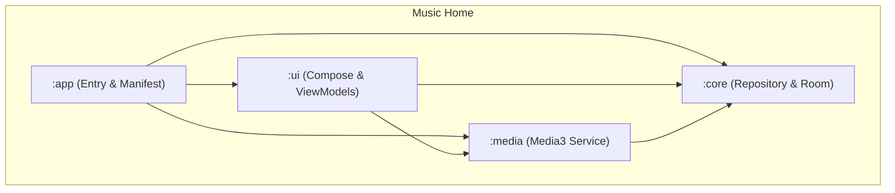

# Music Home 🎶🛡️

**Music Home** is a dedicated Android Home Launcher designed to transform unused or old Android devices into **dedicated music playback stations**.

It strips away the distractions of a standard phone interface and replaces it with a high-fidelity, music-centric environment inspired by classic high-end audio equipment like Sony Walkmans and vintage amplifiers.

---

## 📸 Screenshots

*Screenshots coming soon!*

---

## 🚧 Project Status

Music Home is currently under active development.

**Current focus:**
- [x] Home Launcher registration
- [x] Basic "Walkman Orange" UI implementation
- [x] Media3 Playback Service integration
- [/] Local Media Scanning & Room Database integration
- [ ] Adaptive Tablet Layouts

---

## 🎯 Target Devices

Designed to give a new purpose to recycled hardware:

- **Old Android Tablets**: Transform them into wall-mounted control panels.
- **Legacy Laptops/Chromebooks**: Dedicated desk-side audio stations.
- **Spare Smartphones**: Create a permanent, distraction-free bedside player.
- **Dedicated DAP-style devices**: A custom OS feel for offline-first listening.

---

## ✨ Features

- **🏠 Home Launcher Replacement**: Registers as a system home screen. Pressing the 'Home' button always brings you back to your music.
- **🎧 Walkman-Inspired UI**: A premium dark-themed interface with metallic accents and vibrant "Walkman Orange" highlights.
- **📱 Integrated App Drawer**: A dedicated "Extras" tab that allows you to launch other music-related apps (Spotify, YouTube Music, Tidal) without leaving the immersive environment.
- **🕒 Appliance Mode**: Persistent clock, battery status, and full **Immersive Mode** support (hiding status/navigation bars).
- **📂 Local Library Management**: Seamlessly browse and play local MP3/FLAC files using a robust modern media engine (Media3/ExoPlayer).

---

## 🏗️ Architecture

The project follows a modularized Clean Architecture approach.

- **`:app`**: Entry point. Handles `MainActivity` (Launcher), Boot Receivers, and system configurations.
- **`:ui`**: The visual layer. Built with **Jetpack Compose**. Contains Screens and ViewModels.
- **`:core`**: Business logic. Contains Room entities, Repository implementations, and MediaStore interaction.
- **`:media`**: Audio engine. Houses the `MusicPlaybackService` using **AndroidX Media3**.

---

## 🛠️ Tech Stack

- **Language**: Kotlin 2.0.21
- **UI Framework**: Jetpack Compose (Material 3)
- **Media Engine**: AndroidX Media3 / ExoPlayer
- **Dependency Management**: Gradle Version Catalog
- **Local Storage**: Room Persistence Library

---

## 🗺️ Roadmap

- [x] Launcher replacement functionality
- [x] Immersive Mode & Boot-start support
- [x] Walkman UI Theme refinement
- [ ] Full Local Library browsing (Artists, Albums, Playlists)
- [ ] Hardware volume integration & Audio Focus handling
- [ ] Tablet-optimized Two-Pane Layout
- [ ] Sleep Timer & Bedside Clock Mode
- [ ] Audio Visualizers

---

## 🚀 Getting Started

1. Clone the repository and open in Android Studio.
2. Build and run the `app` module on your target device.
3. Select **Music Home** as your **Home app** when prompted.

---

## 📜 License

This project is licensed under the MIT License.

Created by **Lemon Squad**. Optimized for music lovers.
