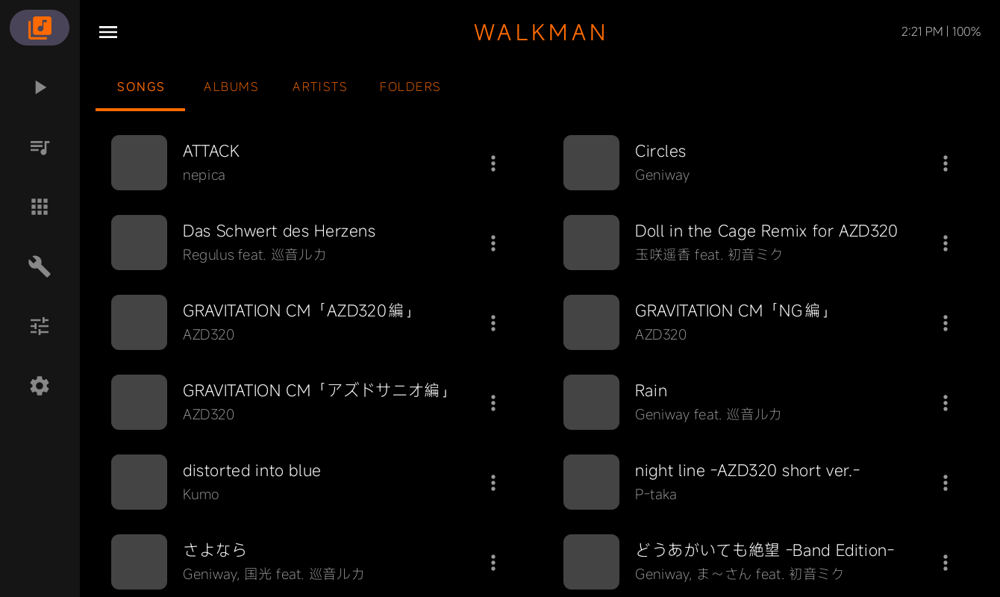
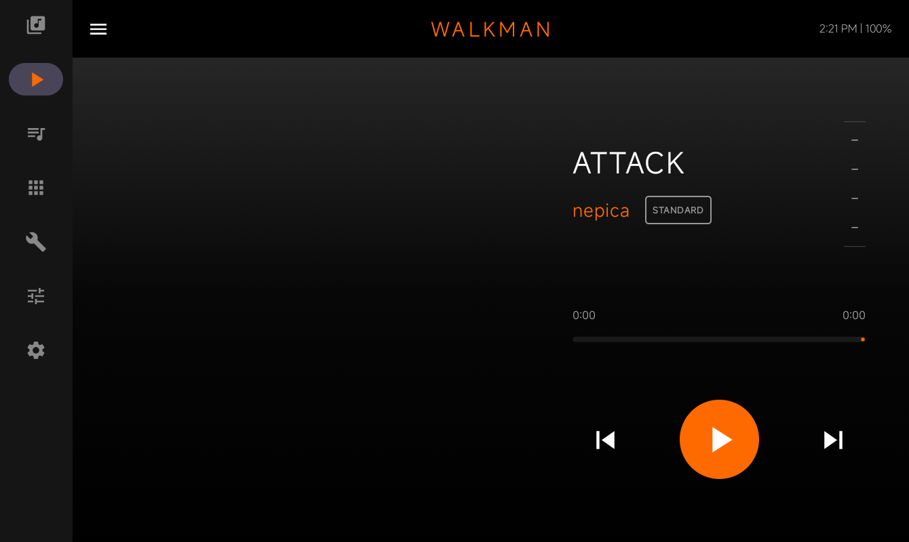
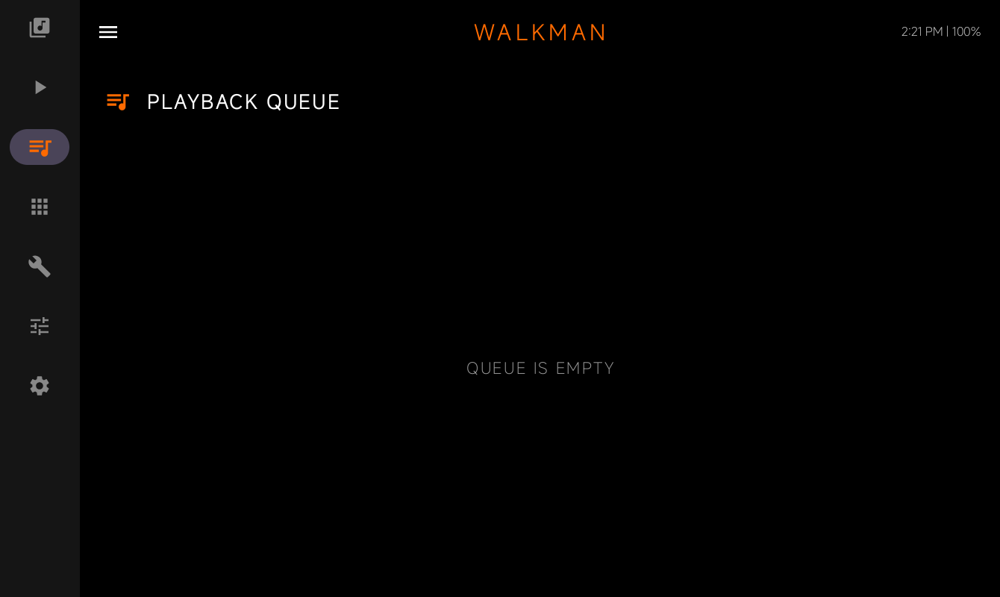
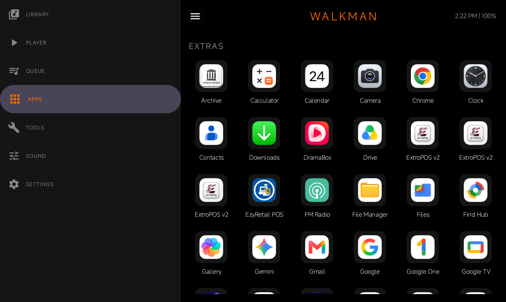
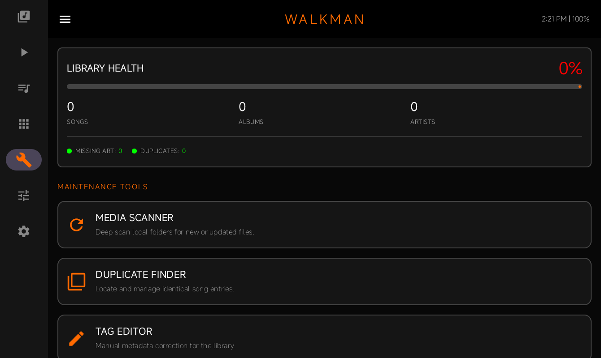
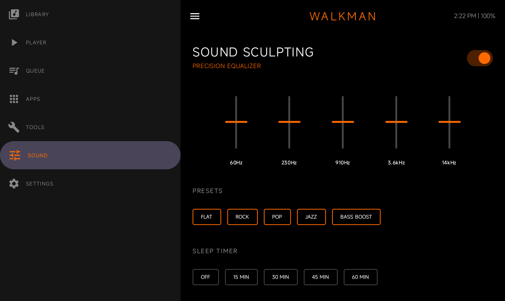
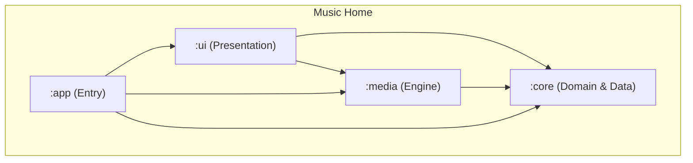

# Music Home 🎶🛡️

**Music Home transforms Android devices into dedicated music appliances / DAP-style platforms.** Rather than behaving like a traditional Android launcher, Music Home presents a dedicated, distraction-free music environment where playback is always the primary experience.

It strips away the distractions of a standard phone interface and replaces it with a high-fidelity, music-centric environment inspired by classic high-end audio equipment like Sony Walkmans, vintage amplifiers, and modern high-end DAPs (Digital Audio Players).

---

## 📸 Screenshots

| Library | Player | Queue |
| :---: | :---: | :---: |
|  |  |  |

| Apps | Library Tools | Sound (EQ) |
| :---: | :---: | :---: |
|  |  |  |

---

## 💡 Why Music Home?

Modern Android devices are designed around notifications, social media, and constant interaction. Music Home takes the opposite approach.

It turns unused Android hardware into a single-purpose music machine:
- **No distractions**: Just your music library.
- **Offline-first playback**: No dependence on cloud services.
- **Large album artwork**: Beautifully displayed metadata.
- **Hardware-inspired controls**: Physical feel in a digital interface.
- **Always ready**: Your device becomes a dedicated player, not a multitasker.

---

## 🏛️ Philosophy

Music Home is built on a simple idea: **Old Android devices deserve a second life.**

Instead of becoming e-waste, they can become beautiful, dedicated music players that remain focused on one purpose—enjoying your music without distractions. Music Home aims to make Android disappear, leaving only the music.

---

## 🚧 Project Status (v1.3.0 "Library Tools")

Music Home has evolved into a comprehensive **Open-Source DAP Platform** with built-in maintenance capabilities.

**Current focus:**
- [x] Home Launcher registration
- [x] "Walkman Orange" Hardware UI Identity
- [x] Real-time 16-band Spectrum Visualizer
- [x] Advanced Multi-band Equalizer
- [x] Intelligent Artwork Caching (Persistent 512px JPGs)
- [x] **Direct Access**: Manual path selection & recursive folder browsing
- [x] **Appliance Memory**: Persistent playback position & queue recovery
- [x] **Hardware Integration**: Physical volume interception & custom HUDs
- [x] **Library Tools**: Built-in maintenance workshop (Scanner, Duplicates, Health)

---

## ⚡ Designed for Legacy Hardware

Music Home is optimized for devices that are no longer useful as daily phones. The goal is smooth playback with minimal background activity.

**Ideal targets:**
- **Old Android Tablets**: Transform them into wall-mounted control panels or bedside hi-fi hubs.
- **Spare Android Smartphones**: Create a permanent, distraction-free pocket player.
- **Retired DAP Hardware**: Give old specialized hardware a fresh, modern OS experience.
- **Android TV Boxes**: Turn them into dedicated media hub appliances.

---

## 🎵 Supported Audio

Currently supports standard Android Media3 codec formats:
- **Lossless**: FLAC, WAV
- **Lossy**: MP3, OGG, AAC
- **Container**: M4A

---

## ✨ Features

- **🏠 Dedicated Appliance Mode**: Registers as the system home screen. The "Home" button is a "Return to Music" button.
- **🎧 Hardware-Inspired UI**: A premium dark-themed interface with metallic accents, brushed textures, and vibrant "Walkman Orange" glows.
- **📊 Real-time Visualization**: Integrated 16-band spectrum visualizer optimized for legacy hardware (30Hz refresh).
- **🎚️ Pro Audio Controls**: High-fidelity vertical EQ sliders with system preset support (Rock, Pop, Bass Boost).
- **📂 Flexible Library**: Mix system MediaStore results with **Manual Watched Folders** for total control over your collection.
- **🕒 Hi-Fi Display**: Persistent clock, battery status, and bitrate information integrated like a high-end audio deck.
- **🎵 Offline First**: Built around local music libraries. Your collection stays on your device and remains fully functional without an Internet connection.

---

## 🏗️ Architecture

The project follows a modularized **Clean Architecture** approach.

- **`:app`**: Entry point. Handles `MainActivity` (Launcher), hardware key interception, and manifest permissions.
- **`:ui`**: The visual layer. Built with **Jetpack Compose** using custom hardware-inspired components.
- **`:core`**: The heart of the app. Houses **Manual Scanning**, **Artwork Caching**, and **Room Persistence**.
- **`:media`**: Audio engine using **AndroidX Media3**, **AudioFX (EQ)**, and **Visualizer API**.

---

## 🛠️ Tech Stack

- **Language**: Kotlin 2.x
- **UI Framework**: Jetpack Compose (Material 3 Adaptive)
- **Audio Processing**: Android AudioFX + Visualizer API
- **Media Engine**: AndroidX Media3 / ExoPlayer
- **Local Storage**: Room Persistence Library (Migration v3)
- **Image Handling**: Coil + Palette API (Dynamic Backgrounds)

---

## 🗺️ Roadmap

- [x] Launcher replacement functionality
- [x] Immersive Mode & Boot-start support
- [x] Walkman UI Theme refinement
- [x] **Real-time MediaStore synchronization** (Throttled Observer)
- [x] **Full Local Library browsing** (Artists, Albums, Folders)
- [x] **Hardware volume integration** & custom HUDs
- [x] **Adaptive Appliance Layouts** (Phone/Tablet/Focus modes)
- [x] **Album artwork fetching & caching**
- [x] **Folder browsing & Equalizer**
- [x] **Library Maintenance Suite** (Duplicate Finder, Tag Editor)
- [ ] **USB DAC support** (Direct bit-perfect output)
- [ ] **Internet Radio integration** (Shoutcast/TuneIn)

---

## 🚀 Getting Started

1. Clone the repository and open in Android Studio.
2. Build and run the `app` module on your target device (Android 7.0+).
3. Select **Music Home** as your **Home app** when prompted.
4. Go to the **FOLDERS** tab to add your music directories.

---

## 📜 License

This project is licensed under the MIT License.

Created by **Lemon Squad**. Optimized for music lovers.
