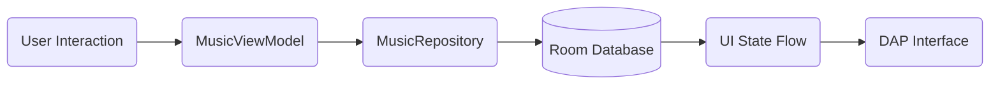

# Music Home Playback Architecture

This document describes the modular playback session architecture implemented in Phase 4. It establishes a durable, platform-independent foundation for all audio operations within the Music Home DAP environment.

---

## 1. The Playback Session Model

The `PlaybackSession` is the single source of truth for the device's state. It is managed by the `MusicRepository` and consumed by the `MusicViewModel`.

### Core Components
- **PlaybackQueue**: A versioned collection of songs, including the current index, shuffle state, and repeat mode.
- **Session Versioning**: The `sessionVersion` tracks schema changes for long-term data safety.
- **Queue Revisioning**: Every mutation (reorder, removal) increments a `revision` number to ensure atomic persistence.

---

## 2. Queue Mutation Lifecycle

Queue changes follow a strict "Persist-First" flow to ensure the DAP never loses state during unexpected process death.



1.  **Mutation**: User reorders or removes an item.
2.  **Revision**: The `revision` count is incremented.
3.  **Persistence**: The repository immediately writes the updated `PlaybackStateEntity` to the database.
4.  **Propagation**: The `currentQueue` StateFlow emits the new state, updating the UI.

---

## 3. Persistent Session Recovery (Silent Resume)

Music Home implements a "Hardware Resume" behavior that restores the exact listening context on app launch.

- **Initialization**: On `MusicViewModel` creation, the repository reads the last saved `PlaybackStateEntity`.
- **Restoration**: 
    - The queue is reconstructed using the saved `queueIds`.
    - The `ExoPlayer` is prepared and seeked to the exact `positionMs` (timestamp).
- **Auto-Navigation**: If music was actively playing during the last session, the app automatically navigates to the **Player** screen. Otherwise, it restores the **Last Active Tab**.

---

## 4. Audio Transition Architecture

Transitions are decoupled from the playback engine through the `TransitionStrategy` interface.

### TransitionStrategy Interface
- `prepare(player: Player)`: Prepare decoders or buffer next track.
- `begin(player: Player)`: Trigger the physical transition.
- `finish(player: Player)`: Cleanup resources.

### Implementations
- **InstantTransition (Current)**: Standard track switching with minimal latency.
- **CrossfadeTransition (Future)**: Overlapping Track A and Track B for seamless blending.
- **GaplessTransition (Future)**: Precise sample-accurate concatenation for live/classical albums.

---

## 5. Telemetry & High-Honesty Flow

The telemetry system ensures the UI is always an honest reflection of the hardware path.

```
Media3 Engine (ExoPlayer)
    |
    ↓ [Raw Format/Tracks]
AudioTelemetry (Media3AudioEngine)
    |
    ↓ [Verified/Estimated/Unknown]
DeviceState
    |
    ↓
DAP Cockpit / LED / Badges
```

- **Verification Status**: No "Bit Perfect" claims are made unless the `UsbManager` confirms a direct hardware path to an external DAC.
- **Output Priority**: The system prioritizes the physical destination (Bluetooth, DAC, Speaker) over the source file format when determining the device LED state.

---

## 6. Safety & Protection

- **Volume Guard**: On startup, if the previous volume was > 70%, it is automatically reset to **50%** to protect equipment.
- **OLED Protection**: The `AmbientPlayer` uses the `DeviceState` to trigger invisible pixel-shifting and ambient dimming during long sessions.
